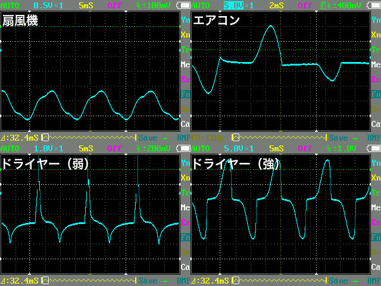

##  シリアル出力 交流電流計 (PIC 12F1822)<!-- omit in toc -->

---
[Home](https://oasis3855.github.io/webpage/) > [Software](https://oasis3855.github.io/webpage/software/index.html) > [Software Download](https://oasis3855.github.io/webpage/software/software-download.html) > [ct-ammeter-12f1822](../ct-ammeter-12f1822/README.md) > ***ct-ammeter-12f1822*** (this page)

<br />
<br />

Last Updated : Jul. 2016

- [ソフトウエアのダウンロード](#ソフトウエアのダウンロード)
- [概要](#概要)
- [今回用いた変流器 CTL-6-P-H](#今回用いた変流器-ctl-6-p-h)
- [測定ターゲットに合わせ、2種類の回路を作成した](#測定ターゲットに合わせ2種類の回路を作成した)
  - [ターゲットが正弦波の場合 (v10\_sincurve)](#ターゲットが正弦波の場合-v10_sincurve)
  - [ターゲットが正弦波以外のあらゆる波形の場合 (v20\_multicurve)](#ターゲットが正弦波以外のあらゆる波形の場合-v20_multicurve)
- [ターゲットが正弦波の場合 (v10\_sincurve) の回路](#ターゲットが正弦波の場合-v10_sincurve-の回路)
  - [PICソースコード](#picソースコード)
  - [ターゲットが正弦波以外のあらゆる波形の場合 (v20\_multicurve)の回路](#ターゲットが正弦波以外のあらゆる波形の場合-v20_multicurveの回路)
- [PICソースコード](#picソースコード-1)
- [Linuxでのシリアルデータ方法](#linuxでのシリアルデータ方法)
- [バージョンアップ情報](#バージョンアップ情報)
- [ライセンス](#ライセンス)


<br />
<br />

## ソフトウエアのダウンロード

-    [このGitHubリポジトリを参照する](../ct-ammeter-12f1822/download) 

-    [GoogleDriveを参照する](https://drive.google.com/drive/folders/1KihYOXA1OasvOtyQMxRpR-JeSnQgqkbx) 

<br />
<br />

## 概要

AC電流測定用の変流器（CT）を用いてAC電流を測るPICマイコンを利用した測定器。2秒に1回の電流値がシリアル出力されるので、それをPC等で取り込むことで電流ロガーとして利用できる。

変流器（CT）は抵抗付きのものと、抵抗を自分で用意して取り付けなければならないものがある。日本の電子部品屋で売っているものは抵抗なしのが多く、中国の商社から直接輸入する時は抵抗付きのものが多い。

<br />
<br />

## 今回用いた変流器 CTL-6-P-H 

今回はURD社のCTL-6-P-Hという小型変流器を用いた。


0.1Aから10A （100Vの場合は10Wから1000Wまで）計測できるよう、その範囲で直線変化する100Ω抵抗を選択した（赤で着色）。

<br />
<br />

## 測定ターゲットに合わせ、2種類の回路を作成した

### ターゲットが正弦波の場合 (v10_sincurve)

実際の家電品等ではありえない、理想的な交流波形の場合を対象とするプログラムを ソースコードディレクトリの v10_sincurve に格納した。


<br />例）ニクロム線ヒーターの測定

<br />
<br />

### ターゲットが正弦波以外のあらゆる波形の場合 (v20_multicurve)

実際の家電品で測定する場合、次に示すような複雑な波形となる。これに対応したプログラムは、ソースコードディレクトリの v20_multicurve に格納した。



<br />
<br />

## ターゲットが正弦波の場合 (v10_sincurve) の回路


交流電流センサーは、測定対象の交流波形が「そのまま縮小（減圧）」して出てくるだけなので、特性曲線で1Aと書いてあれば -1A 〜 +1A の範囲の電圧が出てくることになる。

PICのA/D変換器に負電圧を加えるわけにはいかないので、センサーの（仮想的にGNDとする）片方の極を適当な電圧までプルアップして、I/O端子に負電圧が出てこないようにする。今回は、可変抵抗（4kΩ）を用いてVcc/2＝2.5V程度にプルアップしている。

実際にクランプメータとにらめっこして、だいたい次の程度の返還率になっていた。

- 交流センサーの全振幅 1V （±0.5V） → 測定対象の電流 3A
- 交流センサーの全振幅 2V （±1.0V） → 測定対象の電流 6A 


<br />ブレッドボード上に組んだ試作回路


<br />測定中の波形。2.5Vにプルアップされている

オシロスコープによる観察で、波形上に±0.1V程度のランダム・ノイズが乗っているのが分かる。電源としている「USB電源アダプター」から出ているものなので、乾電池で動くようにすれば少しはノイズが減る。さらに、センサーから基盤までの配線が長いと、空中の電波ノイズを拾ってしまうので、ケーブルも短く… 

### PICソースコード

ソースコードディレクトリ内のv10_sincurveに格納している。

浮動小数点処理を行わせるとファームウエアのサイズが一気に大きくなるため、表示部分は16進数を簡易的に固定小数点値に変換している。 

<br />
<br />

### ターゲットが正弦波以外のあらゆる波形の場合 (v20_multicurve)の回路


[BSch3V用回路図ファイルをダウンロードする](download/12f1822-ct-ammeter-v2.CE3)


[PasS用プリント基板ファイルをダウンロードする](download/12f1822-ct-ammeter-v2.pas)


## PICソースコード

ソースコードディレクトリ内のv20_multicurveに格納している。


動作確認済み開発環境

- 開発言語 Microchip XC 8

<br />
<br />

## Linuxでのシリアルデータ方法

**Linuxコンソールでの操作例**

```bash
$ sudo stty -F /dev/ttyUSB0 9600 cs8
$ sudo cat /dev/ttyUSB0

512,480,270,100
512,480,270,100
512,480,270,100

```

<br />
<br />

## バージョンアップ情報

- 正弦波の場合 (v10_sincurve) 版
  -  Version 1.0 (2015/12/31) 

- あらゆる波形の場合 (v20_multicurve) 版
  -  Version 1.0 (2016/07/17) 

<br />
<br />

## ライセンス

このソフトウエアは [GNU General Public License v3ライセンスで公開する](https://gpl.mhatta.org/gpl.ja.html) フリーソフトウエア

