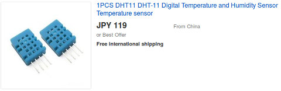
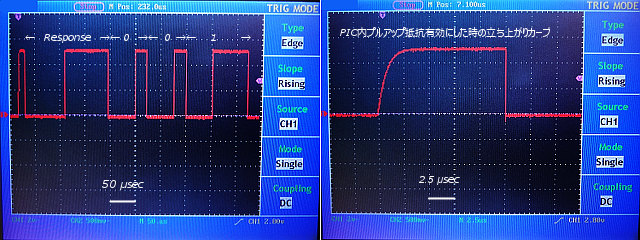
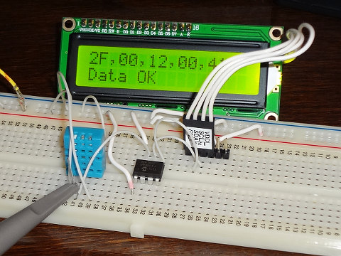

##  温湿度センサー DHT11を使う (PIC 12F1822)<!-- omit in toc -->

---
[Home](https://oasis3855.github.io/webpage/) > [Software](https://oasis3855.github.io/webpage/software/index.html) > [Software Download](https://oasis3855.github.io/webpage/software/software-download.html) > [dht11-humid-12f1822](../dht11-humid-12f1822/README.md) > ***dht11-humid-12f1822*** (this page)

<br />
<br />

Last Updated : Dec. 2015

- [ソフトウエアのダウンロード](#ソフトウエアのダウンロード)
- [概要](#概要)
- [サンプル回路図と信号タイミング](#サンプル回路図と信号タイミング)
- [バージョンアップ情報](#バージョンアップ情報)
- [ライセンス](#ライセンス)


<br />
<br />

## ソフトウエアのダウンロード

-    [このGitHubリポジトリを参照する](../dht11-humid-12f1822/download) 

-    [GoogleDriveを参照する](https://drive.google.com/drive/folders/1KihYOXA1OasvOtyQMxRpR-JeSnQgqkbx) 

<br />
<br />

## 概要

1個100円程度のデジタル温湿度センサー。整数値しか取り出せず誤差も±2℃・±5％RHと大きいが、低価格の魅力には使わざるを得ない場合も…。上位機種のDHT22が350円位なので、予算に余裕があるならそちらで。 



<br />
<br />

## サンプル回路図と信号タイミング

DHT11は送受信を一つの信号線で兼用するタイプのデジタル センサー モジュール。ホスト（PIC）側からLo信号を18ミリ秒送信すると、DHT11が起動してスタート・ビット（80us Lo + 80 us Hi）とデータ5バイト分を一気に送信してくる。


[BSch3V用回路図ファイルをダウンロードする](download/pic-dht11.CE3)

<br />
<br />

dht11.c の処理開始信号部抜粋

```C
// DHT11に処理開始信号を送る (Loを18ms以上続ける）
// I/O = Lo
TRIS_DHT11 = 0; // 「DHT11接続ポート」を出力モードに
PORT_DHT11 = 0; // 「DHT11接続ポート」 = Lo
// 25 msec Loを保持（18 msec以上）
__delay_ms(25);
// I/O = Hi （入力モードにすることで、自動的にプルアップされる）
TRIS_DHT11 = 1; // 「DHT11接続ポート」を入力モードに
// プルアップ抵抗で「DHT11接続ポート」が充電される時間待つ（実測では5〜10usec以上）
__delay_us(20);
```

オシロスコープで波形観察したデータを次に示す。ホスト（PIC側）送信が終了し、読み取りモードとなった時の電圧立ち上がりカーブを右側に示した。プルアップ抵抗によりI/O線が充電される時間を考慮して当Webページに掲載したライブラリには20マイクロ秒待つように設定している。（10マイクロ秒では少し足らなかつた） 



<br />
<br />


<br />ブレッドボード上に制作した回路。DHT11センサーは、網目の面が表で左からVcc, I/O, NC, GNDピンとなっている。 

<br />
<br />

## バージョンアップ情報

-  Version 1.0 (2015/12/31) 

<br />
<br />

## ライセンス

このソフトウエアは [GNU General Public License v3ライセンスで公開する](https://gpl.mhatta.org/gpl.ja.html) フリーソフトウエア
