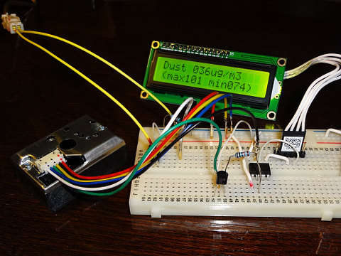
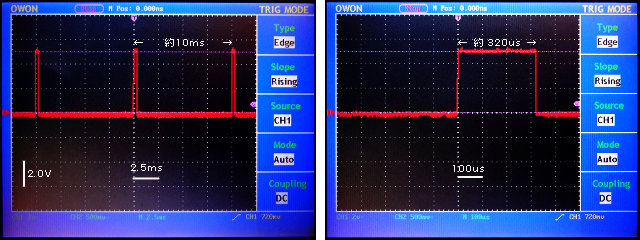
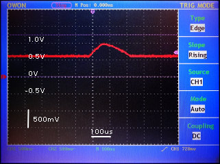
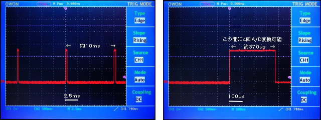

##  粉塵センサー GP2Y1010AU0Fを使う (PIC 12F1822)<!-- omit in toc -->

---
[Home](https://oasis3855.github.io/webpage/) > [Software](https://oasis3855.github.io/webpage/software/index.html) > [Software Download](https://oasis3855.github.io/webpage/software/software-download.html) > [dustsensor-12f1822](../dustsensor-12f1822/README.md) > ***dustsensor-12f1822*** (this page)

<br />
<br />

Last Updated : Jan. 2016

- [ソフトウエアのダウンロード](#ソフトウエアのダウンロード)
- [概要](#概要)
- [サンプル回路図と信号タイミング](#サンプル回路図と信号タイミング)
- [回路作成写真とオシロスコープでの波形観察](#回路作成写真とオシロスコープでの波形観察)
- [A/D変換回数](#ad変換回数)
  - [single\_measure](#single_measure)
  - [multi\_measure](#multi_measure)
- [バージョンアップ情報](#バージョンアップ情報)
- [ライセンス](#ライセンス)


<br />
<br />

## ソフトウエアのダウンロード

-    [このGitHubリポジトリを参照する](../dustsensor-12f1822/download) 

-    [GoogleDriveを参照する](https://drive.google.com/drive/folders/1KihYOXA1OasvOtyQMxRpR-JeSnQgqkbx) 

<br />
<br />

## 概要


eBayで1個500円程度の粉塵センサー。対象とする粉塵はSPMなのかPM2.5なのか… 製造メーカーのマニュアルには「粉塵」としか書かれていない。家庭用集じん機などに使うパーツなのだろう。

<br />
<br />

## サンプル回路図と信号タイミング 

センサー内のLEDをを点灯し、粉塵で散乱した光の強さを増幅して返す「アナログ」センサー。LEDの点灯タイミングや、散乱光の測定タイミングもユーザが全て制御してやる必要がある。マニュアルに示されたタイミングと、得られる出力電圧と粉じん濃度の関係は次のようなもの。 


このグラフの直線部分を一次回帰曲線として数式化した [粉塵濃度] = ([電圧] - 0.78)/0.0063 をプログラム中で利用する。（一時回帰分析をしたときの[LibreOffice Calcファイルをダウンロード](download/pic-dustsensor-graph.ods)） 


マニュアルに示されたサンプル回路を参考に、PIC 12F1822用に少しだけアレンジした回路図。 （[BSch3V用回路図ファイルをダウンロードする](download/pic-dustsensor.CE3)）

<br />
<br />

## 回路作成写真とオシロスコープでの波形観察 



<br />
<br />

オシロスコープで波形観察したデータを次に示す。マニュアルに示されるとおり、10ミリ秒ごとに0.32ミリ秒だけLEDを点灯し、LED点灯開始から0.28ミリ秒後にセンサーからの出力をA/D変換するプログラムを作成した。そのときのオシロスコープでの観察結果は次の通り。 


<br />LED点灯のためのセンサー入力信号

<br />
<br />

また、センサーから返される波形は、少しだけマニュアルと違うが次のような感じだ。 


<br />センサー出力信号

<br />
<br />

## A/D変換回数 

### single_measure

1回のみ、決め打ちでA/D変換して粉塵濃度をキャラクタ液晶に表示するプログラム。 

```C
void single_measure(unsigned int *value_max, unsigned int *value_min) {
        // 30回測定して、最大値を測定結果として画面表示する
        for(unsigned short int i = 0; i < 30; i++){
            // GP2Y1010AU0FのLEDをONにする320usの間に、1回 A/D変換して電圧値を得る処理
 
            ADCON0 = 0b00000001;            // AN0チャンネル選択, A/D機能ON
            PORTAbits.RA5 = 1;              // 測定LED ON
            __delay_us(280);                // A/D変換器チャージ時間10usを含み280us待つ
            ADCON0 = 0b00000011;            // AN0チャンネル選択, A/D開始, A/D機能ON
            while(ADCON0bits.GO_nDONE){}    // A/D変換完了を待つ
            unsigned int value = ADRESH << 8 | ADRESL;
            ADCON0 = 0;                     // AN0選択, A/D機能停止
            PORTAbits.RA5 = 0;              // 測定LED OFF
 
            if(value > *value_max) *value_max = value;
            if(*value_min > value) *value_min = value;
 
            // GP2Y1010AU0Fの最低測定間隔は10msのため、残り9.7ms待つ
            __delay_us(9700);
        }
}
```

<br />
<br />

### multi_measure

1回だけA/D変換するところを、マイコンの処理能力が許す限り複数回A/D変換して最大値を得るように改変してみたのが次のプログラム。オシロスコープでタイミングを観察しながら、A/D変換できる最大回数は「たったの4回」。 

```C
void multi_measure(unsigned int *value_max, unsigned int *value_min) {
        // 30回測定して、最大値を測定結果として画面表示する
        for(unsigned short int i = 0; i < 30; i++){
            // GP2Y1010AU0FのLEDをONにする320usの間に、1回 A/D変換して電圧値を得る処理
 
            PORTAbits.RA5 = 1;              // 測定LED ON
            for(unsigned short int j = 0; j < 4; j++){
                ADCON0 = 0b00000001;            // AN0チャンネル選択, A/D機能ON
                __delay_us(7);                  // A/D変換器チャージ時間4.97us以上待つ
                ADCON0 = 0b00000011;            // AN0チャンネル選択, A/D開始, A/D機能ON
                while(ADCON0bits.GO_nDONE){}    // A/D変換完了を待つ
                unsigned int value = ADRESH << 8 | ADRESL;
                ADCON0 = 0;                     // AN0選択, A/D機能停止
                __delay_us(1);                  // 時間調整
 
                if(value > *value_max) *value_max = value;
                if(*value_min > value) *value_min = value;
            }
            PORTAbits.RA5 = 0;              // 測定LED OFF
 
            // GP2Y1010AU0Fの最低測定間隔は10msのため、残り9.7ms待つ
            __delay_us(9700);
        }
}
```

複数回A/D変換するため、すこしだけLED点灯時間が伸びた。オシロスコープでのタイミングの観察結果。 


<br />LED点灯のためのセンサー入力信号

マイコンの動作周波数を4MHzから引き上げれば、A/D変換回数をもっと増やすことができるが、消費電力量もそれだけ掛かることになる。 

<br />
<br />

## バージョンアップ情報

-  Version 1.0 (2016/01/17) 

<br />
<br />

## ライセンス

このソフトウエアは [GNU General Public License v3ライセンスで公開する](https://gpl.mhatta.org/gpl.ja.html) フリーソフトウエア
