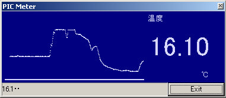
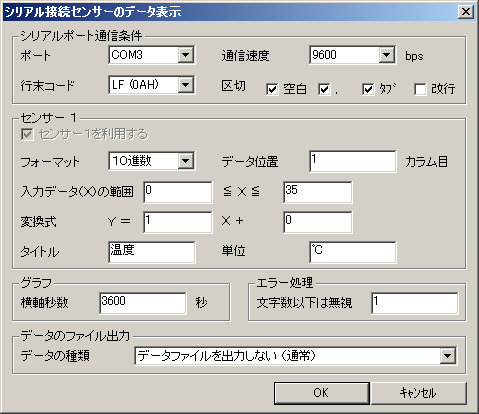

## PIC Meter : シリアルデータ受信・グラフ化ソフトウエア for Windows<!-- omit in toc -->

---
[Home](https://oasis3855.github.io/webpage/) > [Software](https://oasis3855.github.io/webpage/software/index.html) > [Software Download](https://oasis3855.github.io/webpage/software/software-download.html) > [picmeter-win](../picmeter-win/README.md) > ***picmeter-win*** (this page)

<br />
<br />

Last Updated : Feb. 2013


- [ソフトウエアのダウンロード](#ソフトウエアのダウンロード)
- [概要](#概要)
- [バージョンアップ情報](#バージョンアップ情報)
- [ライセンス](#ライセンス)

<br />
<br />

## ソフトウエアのダウンロード

-    [このGitHubリポジトリを参照する](../picmeter-win/download) 

-    [GoogleDriveを参照する](https://drive.google.com/drive/folders/1KihYOXA1OasvOtyQMxRpR-JeSnQgqkbx) 

<br />
<br />

## 概要

シリアル接続でデータを受信しグラフを表示する。また同時にデータをファイルに記録することも可能。



<br/>PIC Meter実行画面


<br/>PIC Meter設定画面

**受信可能なシリアル出力例**

```
16.3
16.3
16.2
16.2
16.3
```

<br />
<br />

## バージョンアップ情報

-  Version 1.0 (2005/03/21) 
-  Version 1.1 (2013/02/09) 

<br />
<br />

## ライセンス

このソフトウエアは [GNU General Public License v3ライセンスで公開する](https://gpl.mhatta.org/gpl.ja.html) フリーソフトウエア
