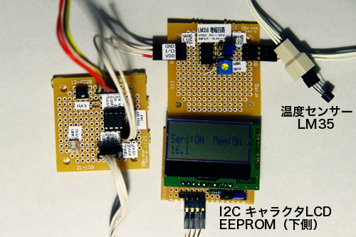
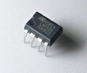

##  ログデータ保存機能つきLCD表示温度計 (PIC 12F1822)<!-- omit in toc -->

---
[Home](https://oasis3855.github.io/webpage/) > [Software](https://oasis3855.github.io/webpage/software/index.html) > [Software Download](https://oasis3855.github.io/webpage/software/software-download.html) > [thermometer-12f1822](../thermometer-12f1822/README.md) > ***thermometer-12f1822*** (this page)

<br />
<br />

Last Updated : Feb. 2013


- [ソフトウエアのダウンロード](#ソフトウエアのダウンロード)
- [概要](#概要)
  - [温度測定ユニットのバリエーション](#温度測定ユニットのバリエーション)
- [主な機能](#主な機能)
  - [コマンド書式](#コマンド書式)
- [回路図・部品表](#回路図部品表)
- [完成写真とシリアル出力例](#完成写真とシリアル出力例)
- [PICソースコード](#picソースコード)
  - [動作確認済み開発環境](#動作確認済み開発環境)
- [Windows版 受信専用ソフト PIC Meter](#windows版-受信専用ソフト-pic-meter)
- [バージョンアップ情報](#バージョンアップ情報)
- [ライセンス](#ライセンス)
- [参考資料](#参考資料)
  - [温度センサーLM35](#温度センサーlm35)
  - [オペアンプLM358](#オペアンプlm358)

<br />
<br />

## ソフトウエアのダウンロード

-    [このGitHubリポジトリを参照する](../thermometer-12f1822/download) 

-    [GoogleDriveを参照する](https://drive.google.com/drive/folders/1KihYOXA1OasvOtyQMxRpR-JeSnQgqkbx) 

<br />
<br />

## 概要

PIC 12F1822とLM35、I2C接続のEEPROMを用いてログデータ保存機能の付いた温度計ユニットの製作。

電流や気圧など電圧で測定値を取り出すタイプのセンサーと交換して、一般的な測定デバイスとして用いることも可能な汎用的な測定ユニットとして使える。

測定値をリアルタイムでシリアル出力するとともに、端末側からコマンド送信することで、保存したログデータの読み出し・消去などが可能。

<br />
<br />

### 温度測定ユニットのバリエーション

この記事を含め3種類のシリアル接続タイプの測定ユニットの設計を公開している。 

| 機能 | 記事名 |
|---|---|
| シリアル出力 | [シリアル接続温度計 (PIC 12F675)](../thermometer-12f675/)  |
| シリアル出力,パラレル接続LCD | [最低・最高温度記憶機能つきLCD表示温度計 (PIC 16F690)](../thermometer-16f690/) |
| シリアル出力,I2C接続LCD,EEPROM記録 | [ログデータ保存機能つきLCD表示温度計 (PIC 12F1822)](../thermometer-12f1822/) ***この記事*** |

<br />
<br />

## 主な機能

- 温度測定範囲 0℃ ～ 50℃ （有効桁:小数点以下1桁）
- LCD表示（現在温度、シリアルポート状態表示、ログ記録モードON/OFF表示）
- シリアル接続（RS232C接続, 9600bps）によるPCへのデータ転送とPCからのコントロール
- EEPROMに気温ログデータの保存（24LC64 EEPROMであれば1分間隔で66時間程度保存可能）
- タクトスイッチによるシリアルポートON/OFF、ログ記録モード- ON/OFFコントロール 

### コマンド書式

シリアル接続した端末から入力

| 機能 | コマンド書式 | 引数の説明 |
|---|---|---|
| 全ログデータの表示（ダンプ） | dump |  |
| EEPROM内全データの消去 | reset |  |


<br />
<br />

## 回路図・部品表


 [BSch3V用回路図ファイルをダウンロードする](download/12f1822-thermometer.ce3)


部品表

| 名称 | 型番・仕様 | 個数・価格 |
|---|---|---|
| PICマイコン | 12F1822 | 1個（145円）|
| 温度センサーIC | LM35DZ | 1個（250円）|
| 汎用オペアンプ | LM358 | 1個（60円）|
| 炭素皮膜抵抗 | 27kΩ | 1個（5円）|
| 炭素皮膜抵抗 | 3kΩ | 1個（5円）|
| 炭素皮膜抵抗 | 10kΩ | 1個（5円）|
| 炭素皮膜抵抗 | 1kΩ | 1個（5円）|
| プッシュスイッチ | PUSHでON | 1個（35円）|
| I2C EEPROM | Microchip 24LC64 | 1個（80円）|
| I2C LCD | Strawberry Linux SB1602A | 1個（700円）|

PIC 12F1822のI/Oピン接続対応表

| PIC側 I/Oピン番号と名称 | 接続先 | I/O方向 |
|---|---|---|
| 02:RA5 | シリアル RX | I |
| 03:RA4 | シリアル TX | O |
| 04:RA3 | タクトスイッチ | I |
| 05:RA2 | I2C SDA | I/O |
| 06:RA1 | I2C SCL | O |
| 07:RA0 | AN0:温度センサー | I |

I2Cデバイスのアドレス

| デバイス | アドレス | 変更する場合のソースコードの位置 |
|---|---|---|
| I2C EEPROM | 0x51 | i2c-eepromlib.cの先頭付近  ```#define EEPROM_I2C_ADDR 0x51``` |
| I2C LCD | 0x3e | i2c-lcdlib-strawberry1602b.hの先頭付近  ```#define LCD_CONTRAST 0x28``` |

<br />
<br />

## 完成写真とシリアル出力例



<br />
<br />

**シリアル出力例**

受信・画面出力だけでなく、キーボード入力かのうなシリアル通信ソフトウエアを用いる。

```
16.3   ← 通常の温度表示
16.3
16.2
dump   ← ダンプ出力の指示(シリアル経由で入力)
d,16.1   ← ダンプ出力（先頭に d, と付く）
d,16.1
d,16.2
d,16.1
d,16.1
d,16.2
16.2
16.1
reset   ← EEPROM内全データの消去指示(シリアル経由で入力)

16.2
```

<br />
<br />

## PICソースコード

-    [このGitHubリポジトリを参照する](../thermometer-12f1822/download) 

LCDはStrawberry Linux SB1602Aを用いているが、他のI2C LCDを用いることも出来る。その場合はLCDライブラリをPIC microcontroller用I2C汎用ライブラリに掲載しているものと差し替えることで対応可能な場合がある。 

### 動作確認済み開発環境

- Microchip MPLAB X IDE ver 1.60
- Microchip MPLAB XC8 ver 1.12

<br />
<br />

## Windows版 受信専用ソフト PIC Meter

シリアル接続でデータを受信しグラフを表示する。また同時にデータをファイルに記録することも可能。

-    [このGitHubリポジトリを参照する](../picmeter-win/) 


<br/>PIC Meter実行画面


<br/>PIC Meter設定画面

<br />
<br />

## バージョンアップ情報

- XC8版
  -  Version 1.0 (2013/02/09) 

<br />
<br />

## ライセンス

このソフトウエアは [GNU General Public License v3ライセンスで公開する](https://gpl.mhatta.org/gpl.ja.html) フリーソフトウエア

<br />
<br />

---

## 参考資料

### 温度センサーLM35 


オペアンプで10倍増幅した値をA/D変換して読み取っている。

テキサスインスツルメンツLM35仕様書(LM35 Datasheet https://www.ti.com/product/LM35)のTypical Applicationsに説明されているように、


Vout(V) = Temperature(℃) * 0.01(V)
但し、+2℃ <= Temperature <= +150℃、誤差0.5℃ @25℃

これをオペアンプで10倍してA/D変換器に入力すれば

A/D入力値(V) = Temperature(℃) * 0.1(V)

Voutが次のグラフの青い線、A/D入力値が赤い線となる。 


<br />
<br />

### オペアンプLM358



今回は単純な増幅回路を使っている。次のような回路の場合、10倍の増幅値を得られる。

詳しくはテキサスインスツルメンツのLM358仕様書(LM358 Datasheet https://www.ti.com/product/LM358)を参照のこと。


