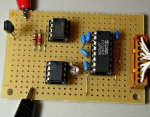
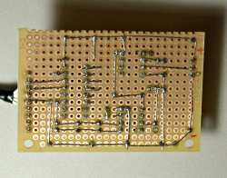
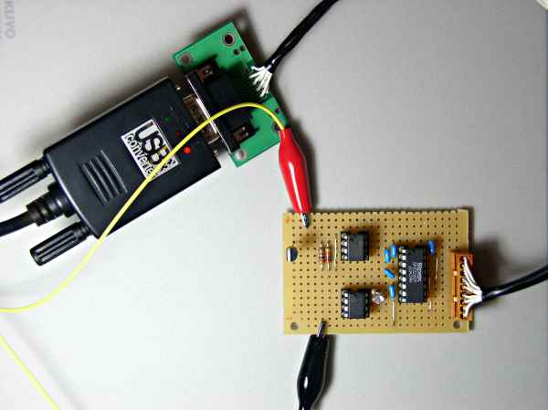
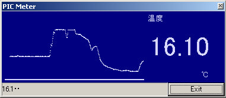
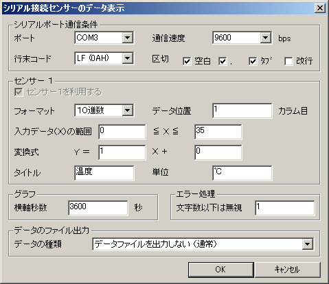
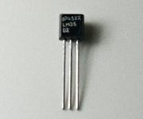
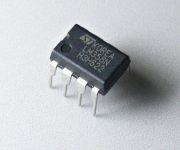
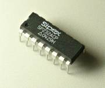

##  シリアル接続温度計 (PIC 12F675)<!-- omit in toc -->

---
[Home](https://oasis3855.github.io/webpage/) > [Software](https://oasis3855.github.io/webpage/software/index.html) > [Software Download](https://oasis3855.github.io/webpage/software/software-download.html) > [thermometer-12f675](../thermometer-12f675/README.md) > ***thermometer-12f675*** (this page)

<br />
<br />

Last Updated : Feb. 2013


- [ソフトウエアのダウンロード](#ソフトウエアのダウンロード)
- [概要](#概要)
  - [温度測定ユニットのバリエーション](#温度測定ユニットのバリエーション)
- [主な機能](#主な機能)
- [回路図・部品表](#回路図部品表)
- [完成写真とシリアル出力例](#完成写真とシリアル出力例)
- [PICソースコード](#picソースコード)
  - [動作確認済み開発環境](#動作確認済み開発環境)
- [Windows版 受信専用ソフト PIC Meter](#windows版-受信専用ソフト-pic-meter)
- [Linux版 受信データ保存スクリプト](#linux版-受信データ保存スクリプト)
- [バージョンアップ情報](#バージョンアップ情報)
- [ライセンス](#ライセンス)
- [参考資料](#参考資料)
  - [温度センサーLM35](#温度センサーlm35)
  - [オペアンプLM358](#オペアンプlm358)
  - [RS232Cドライバ ADM232](#rs232cドライバ-adm232)
  - [参考リンク](#参考リンク)

<br />
<br />

## ソフトウエアのダウンロード

-    [このGitHubリポジトリを参照する](../thermometer-12f675/download) 

-    [GoogleDriveを参照する](https://drive.google.com/drive/folders/1KihYOXA1OasvOtyQMxRpR-JeSnQgqkbx) 

<br />
<br />

## 概要

PIC 12F675にLM35DZを接続して、シリアル経由でデータを出力する最も単純な温度計ユニット。

電流や気圧など電圧で測定値を取り出すタイプのセンサーと交換して、一般的な測定デバイスとして用いることも可能な汎用的な測定ユニットとして使える。

<br />
<br />

### 温度測定ユニットのバリエーション

この記事を含め3種類のシリアル接続タイプの測定ユニットの設計を公開している。

| 機能 | 記事名 |
|---|---|
| シリアル出力 | [シリアル接続温度計 (PIC 12F675)](../thermometer-12f675/) ***この記事*** |
| シリアル出力,パラレル接続LCD | [最低・最高温度記憶機能つきLCD表示温度計 (PIC 16F690)](../thermometer-16f690/) ***この記事*** |
| シリアル出力,I2C接続LCD,EEPROM記録 | [ログデータ保存機能つきLCD表示温度計 (PIC 12F1822)](../thermometer-12f1822/) |

<br />
<br />

## 主な機能

- 温度測定範囲 0℃ ～ 50℃ （有効桁:小数点以下1桁）
- シリアル接続（RS232C接続, 9600bps）によるPCへのデータ転送

<br />
<br />

## 回路図・部品表


 [BSch3V用回路図ファイルをダウンロードする](download/675-temp-sensor.CE3)

温度センサ（LM35DZ）は、0℃で0mVを、以後 10mV/℃ の電圧を出力する。オペアンプ（LM358）で10倍に増幅し、12F675のA/D変換器（AN3ピン）に入力している。

| 名称 | 型番・スペック | 参考価格 |
|---|---|---|
| PIC マイコン | 12F675 | 1個（200円）
| 温度センサIC | LM35DZ | 1個（250円）
| 汎用オペアンプ | LM358 | 1個（40円）
| RS-232CドライバIC | ADM232（同等品 Sipex SP232ACP) | 1個（250円）
| 積層セラミック・コンデンサ | 0.1uF | 5個（ICとセット品）
| 炭素皮膜抵抗 | 27K, 1/4W | 1個（5円）
| 炭素皮膜抵抗 | 3K, 1/4W | 1個（5円）
| 炭素皮膜抵抗 | 470, 1/4W | 1個（5円）
| LED | 2V, 20mA  | 1個（20円）
|アルミ電解コンデンサ | 470uF, 16V | 1個（30円）
| 積層セラミック・コンデンサ | 0.1uF, 50V | 1個（20円）

<br />
<br />

## 完成写真とシリアル出力例

 


<br/>
完成した基板の表面、裏面のようす

<br />
<br />


<br/>温度センサー回路の動作中 （USB-RS232Cコンバータのポートに接続中）

<br />
<br />

**シリアル出力例**

```
16.3
16.3
16.2
16.2
16.3
```

<br />
<br />

## PICソースコード

-    [このGitHubリポジトリを参照する](../tempmeter-12f675/download) 

12f675-serial/xc8ディレクトリ内に収められている。12f675-serial/asmディレクトリには旧版のアセンブラ版が収められている。

### 動作確認済み開発環境

- Microchip MPLAB X IDE ver 1.60
- Microchip MPLAB XC8 ver 1.12

<br />
<br />

## Windows版 受信専用ソフト PIC Meter

シリアル接続でデータを受信しグラフを表示する。また同時にデータをファイルに記録することも可能。

-    [このGitHubリポジトリを参照する](../picmeter-win/) 


<br/>PIC Meter実行画面


<br/>PIC Meter設定画面

アセンブラ版のファームウエアを用いる場合は、通信速度を「2400bps」 フォーマット設定を「16進数」 データ位置を「3カラム目」 変換式を「Y = 0.0488 X + 0」 入力データXの範囲を「0 〜 1023」とすること。

<br />
<br />

## Linux版 受信データ保存スクリプト

Linuxでデータ受信を行う場合は、つぎのようなPerlスクリプトを用いてデータをデコード（温度に変換）すればよい。（この例は、アセンブラ版のファームウエアを使う場合の変換式が入っている）

**pictemp.pl （データ受信スクリプト）**

```Perl
#!/usr/bin/perl

use strict;
use warnings;

my $str_input;

while(<>){
    chomp();
    if(length() != 12){ next; }
    my @arr = split(/ /, $_);
    print sprintf("%.2f", hex($arr[2])*50.0/1024.0)."\n";
}
```

**Linuxコンソールでの操作例**

```bash
$ sudo stty -F /dev/ttyUSB0 2400 cs8
$ cat /dev/ttyUSB0 | perl pictemp.pl

28.52
28.22
28.47
28.61
28.76
28.22
28.56
28.71
```

<br />
<br />

## バージョンアップ情報

- アセンブラ版
  -  Version 1.0 (2005/03/13) 
  -  Version 2.0 (2005/03/20) 
  -  Version 2.0 MPLAB X対応版 (2013/02/09) 

- XC8版
  -  Version 1.0 (2013/02/09) 

<br />
<br />

## ライセンス

このソフトウエアは [GNU General Public License v3ライセンスで公開する](https://gpl.mhatta.org/gpl.ja.html) フリーソフトウエア

<br />
<br />

---

## 参考資料

### 温度センサーLM35



摂氏直読温度センサー

- 電源電圧 +35V ～ -0.2V ... 今回は +5V
で利用。
- 出力電圧 +6V ～ -1.0V ... 今回は 12F675 の A/D
変換を利用するため +5V ～ 0V の範囲を利用。
- 出力電流 10mA
- 動作範囲 0℃ ～ 100℃ ... 今回は 12F675 の A/D
変換を利用するため 0℃～ 50℃ の範囲を利用。
- 誤差 +25℃で±0.6℃

データシート http://www.national.com/pf/LM/LM35.htm


<br />
<br />

### オペアンプLM358



汎用オペアンプ

電源電圧 +3V ～ 32V ... 今回は +5V で利用。
典型的な回路での増幅計算は、次の通り


今回は、R1=3k, R2=27k で Gain = 1 + 27/3 = 10 の 10倍増幅を利用している。

LM358の仕様書では、最大増幅は電源電圧より低い値となるので、5Vまでの増幅は出来ないものと思われる。

データシート http://www.national.com/pf/LM/LM358.html

<br />
<br />

### RS232Cドライバ ADM232



RS-232インターフェース・デバイス

電源電圧 +3.0V ～ 5.5V ... 今回は +5V で利用。

データシート http://www.maxim-ic.com/alternatives.cfm/part/ADM232/pk/287

<br />
<br />

### 参考リンク

- LM35(実験) http://www006.upp.so-net.ne.jp/kosakai/index/LM35.html

- 温度計 （西本氏）http://web1.incl.ne.jp/nisimo/ondokei.html  （← 16bitHEXのBCD変換のソースが載ってます）

- PICと温度計モジュールを利用した、 温度計測装置の作成 （朝日大学） http://scw.asahi-u.ac.jp/~sanozemi/Sakuhin/pic02/PIC02.html

- PIC版３分タイマー付き室温計 （奈良県経営者協会青年部例会） http://wwwdoi.elec.nara-k.ac.jp/html/etc/nr2004/kei/text/

