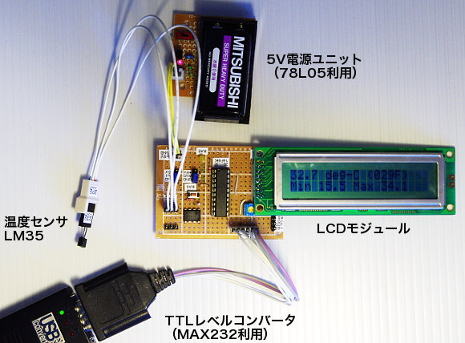
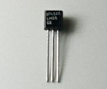

##  最低・最高温度記憶機能つきLCD表示温度計 (PIC 16F690)<!-- omit in toc -->

---
[Home](https://oasis3855.github.io/webpage/) > [Software](https://oasis3855.github.io/webpage/software/index.html) > [Software Download](https://oasis3855.github.io/webpage/software/software-download.html) > [thermometer-16f690](../thermometer-16f690/README.md) > ***thermometer-16f690*** (this page)

 
 

Last Updated : Aug. 2012

- [ソフトウエアのダウンロード](#ソフトウエアのダウンロード)
- [概要](#概要)
  - [温度測定ユニットのバリエーション](#温度測定ユニットのバリエーション)
- [回路図・部品表](#回路図部品表)
  - [PIC 16F690のI/Oピン接続対応表](#pic-16f690のioピン接続対応表)
- [完成写真](#完成写真)
- [PICソースコード](#picソースコード)
- [バージョンアップ情報](#バージョンアップ情報)
- [ライセンス](#ライセンス)
- [参考資料](#参考資料)
  - [温度センサーLM35](#温度センサーlm35)
  - [オペアンプLM358](#オペアンプlm358)

 
 

## ソフトウエアのダウンロード

-    [このGitHubリポジトリを参照する](../thermometer-16f690/download) 

-    [GoogleDriveを参照する](https://drive.google.com/drive/folders/1KihYOXA1OasvOtyQMxRpR-JeSnQgqkbx) 

 
 

## 概要

PIC 16F690とLM35を用いて、最低・最高温度記憶機能の付いた温度計ユニットの製作。

電流や気圧など電圧で測定値を取り出すタイプのセンサーと交換して、一般的な測定デバイスとして用いることも可能な汎用的な測定ユニットとして使える。 

- 温度測定範囲 0℃ ～ 50℃ （有効桁:小数点以下1桁）
- LCD表示（現在温度、A/D変換生データ、最低温度、最高温度）
- シリアル接続（RS232C接続）によるPCへのデータ転送
- 最高温度・最低温度のリセット機能 

 
 

### 温度測定ユニットのバリエーション

この記事を含め3種類のシリアル接続タイプの測定ユニットの設計を公開している。

| 機能 | 記事名 |
|---|---|
| シリアル出力 | [シリアル接続温度計 (PIC 12F675)](../thermometer-12f675/)  |
| シリアル出力,パラレル接続LCD | [最低・最高温度記憶機能つきLCD表示温度計 (PIC 16F690)](../thermometer-16f690/) ***この記事*** |
| シリアル出力,I2C接続LCD,EEPROM記録 | [ログデータ保存機能つきLCD表示温度計 (PIC 12F1822)](../thermometer-12f1822/) |

 
 

## 回路図・部品表 

 [BSch3V用回路図ファイルをダウンロードする](download/PIC16F690-Thermometer.ce3)

|名称 |	型番・仕様 |	個数・価格 |
|---|---|---|
|PICマイコン |	16F690 |	1個（290円）|
|温度センサーIC |	LM35DZ |	1個（250円）|
|汎用オペアンプ |	LM358 |	1個（60円）|
|半固定抵抗 |	203 (20kΩ) |	1個|
|炭素皮膜抵抗 |	27kΩ |	1個|
|炭素皮膜抵抗 |	3kΩ |	1個|
|炭素皮膜抵抗 |	10kΩ |	2個|
|炭素皮膜抵抗 |	1kΩ |	1個|
|プッシュスイッチ |	PUSHでON |	1個|

### PIC 16F690のI/Oピン接続対応表 

| PIC側 I/Oピン番号と名称 |	接続先 |	I/O方向 |
|---|---|---|
|17:RA2/AN2 |	温度センサー |	I|
|04:RA3 |	プッシュスイッチ（最低・最高温度初期化） |	I|
|03:RA4 |	LED（状態表示用） |	O|
|12:RB5/RX |	RX（シリアル受信） |	I|
|10:RB7/TX |	TX（シリアル送信） |	O|
|16:RC0 |	LCD DB4 |	O|
|15:RC1 |	LCD DB5 |	O|
|14:RC2 |	LCD DB6 |	O|
|07:RC3 |	LCD DB7 |	O|
|06:RC4 |	LCD RS 	| O|
|05:RC5 |	LCD R/W |	O|
|08:RC6 |	LCD E |	O |

 
 

##  完成写真 

 
 

## PICソースコード

動作確認済み開発環境

- Microchip MPLAB X IDE ver 1.30
- Microchip MPLAB XC8 ver 1.01 

 
 

## バージョンアップ情報

- XC8版
  -  Version 1.0 (2012/08/26) 

 
 

## ライセンス

このソフトウエアは [GNU General Public License v3ライセンスで公開する](https://gpl.mhatta.org/gpl.ja.html) フリーソフトウエア

 
 

---

## 参考資料

### 温度センサーLM35

オペアンプで10倍増幅した値をA/D変換して読み取っている。

テキサスインスツルメンツLM35仕様書(LM35 Datasheet https://www.ti.com/product/LM35)のTypical Applicationsに説明されているように、 

Vout(V) = Temperature(℃) * 0.01(V)
但し、+2℃ <= Temperature <= +150℃、誤差0.5℃ @25℃

これをオペアンプで10倍してA/D変換器に入力すれば

A/D入力値(V) = Temperature(℃) * 0.1(V)

Voutが次のグラフの青い線、A/D入力値が赤い線となる。 

 
 

### オペアンプLM358

今回は単純な増幅回路を使っている。次のような回路の場合、10倍の増幅値を得られる。

詳しくはテキサスインスツルメンツのLM358仕様書(LM358 Datasheet https://www.ti.com/product/LM358)を参照のこと。 

